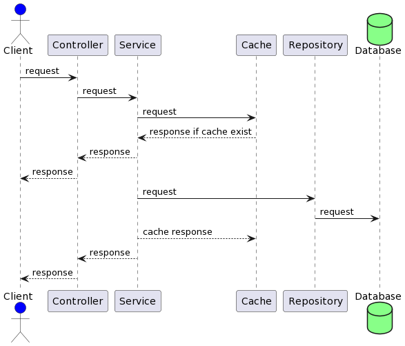
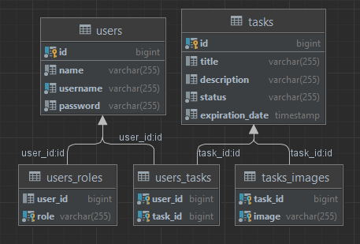

# TasksList

#### The reminder application allows different users to maintain a database of their tasks, and reminder notifications are sent to the user's electronic address an hour before the deadline for completing the task.

#### This springboot application use technology stack: SpringBoot, Hibernate JPA, JWT, Redis, Docker

#### and his all available endpoints are accessed by Swagger in address http://localhost:8090/swagger-ui/index.html

#### Application Taskslist uses Redis for caching, a Postgresql database and MinIO for storage.

## To start:

#### To run the application in the root directory, you need to create a .env file with environments variables:

- `SERVER_PORT`- port of application server
- `HOST_DB`- host of Postgresql database
- `POSTGRES_USERNAME`- username of Postgres database
- `POSTGRES_PASSWORD`- password of Postgres database
- `POSTGRES_DATABASE`- name database
- `POSTGRES_SCHEMA`- name scheme database
- `JWT_SECRET`- JWT tokens secret string

- `REDIS_PASSWORD` - password for Redis
- `REDIS_HOST` - Redis instance host

- `MINIO_BUCKET` - bucket name for MinIO
- `MINIO_URL` - URL for MinIO
- `MINIO_SECRET_KEY` - secret key for MinIO
- `MINIO_ACCESS_KEY` - access key for MinIO

- `SPRING_MAIL_HOST` - host for e-mail
- `SPRING_MAIL_PORT` - port for e-mail
- `SPRING_MAIL_USERNAME` - username for e-mail
- `SPRING_MAIL_PASSWORD` - password for e-mail
## Sequence diagram

## Classes diagram

